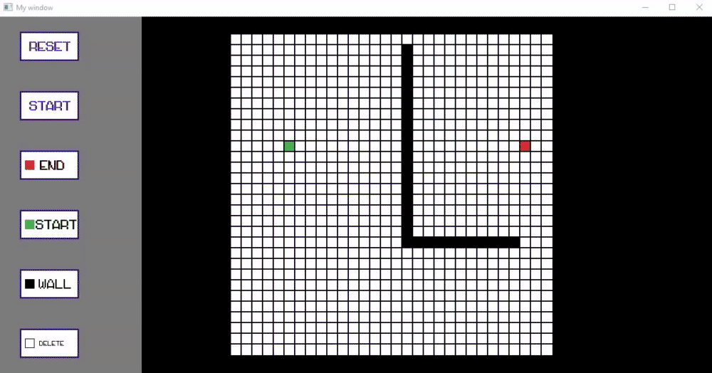

Algorithm visualisation
Tried to make a fun game the most common pathfinding algorithms.

The result:
BFS:

DFS:

A*:

Dijikstra:
 

//========================================================================================
How to run:
To run you will have to have few components:
1.Visual Studio.
2.Sfml

open the folder of the project and just let the cmake generate and executable.
after which you can run it.

Note: you migh need to change the path of the SFML in the CmakeList.txt in the main folder.

//========================================================================================
How to use:
you can choose the algorithm through the terminal
to choose a new one just close the window.
1.Put a start point and end point by pressinng the buttons.
2.put walls if you want.
3.press start
4.enjoy.

//========================================================================================
Note: Dfs is not a path finding algorithm but it is still included.

few final notes:
this project might not use the best tools for this job, it was just a fun learning project
to learn few things as lambdas, void *, runtime generation in sfml etc...
the project might have a few bugs.

writen by: Valeri Materman
contact: valerimat@gmail.com
