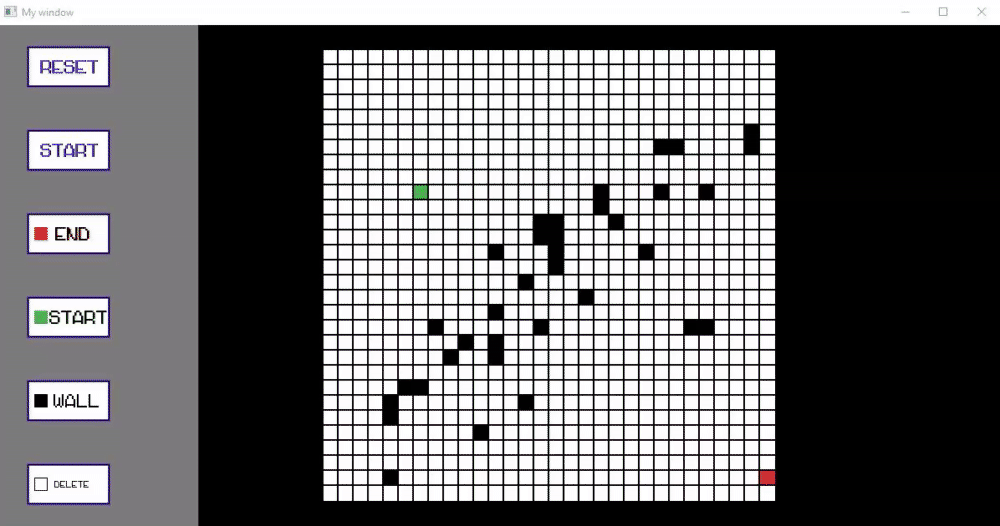
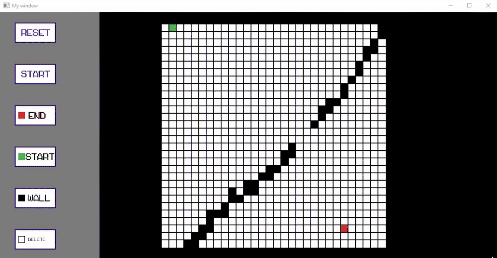
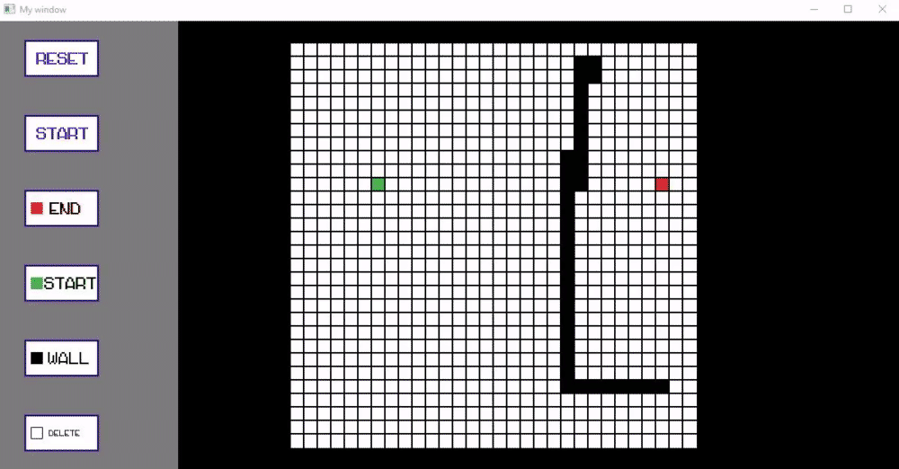

### Algorithm visualisation
A fun visualisation game that shows how the most common pathfinding algorithms work. 

The expected results: 
BFS: 

DFS: 

A*: 

Dijikstra: 

# How to run: 
To run you will have to have few components: 
1.Visual Studio. 
2.Sfml 

open the folder of the project and just let cmake generate and execute. 
After that you can run the game. 
(Note: you might need to change the path of the SFML in the CmakeList.txt ,at the main folder.) 

# How to use: 
Choose the algorithm that you want to visualise using the terminal 
to choose another one just close the window. 
1.Put a start point and end point by pressinng the buttons. 
2.put walls if you want. 
3.press start 
4.enjoy. 
(Note: Dfs is not a path finding algorithm, but it is still included.) 

#  Final notes: 
this project might not use the best tools for this job, it was just a fun learning project 
to learn few things as lambdas, void \*, runtime generation in sfml etc... 
the project might have a few bugs. 

written by Valeri Materman 
contact me at valerimat@gmail.com 
